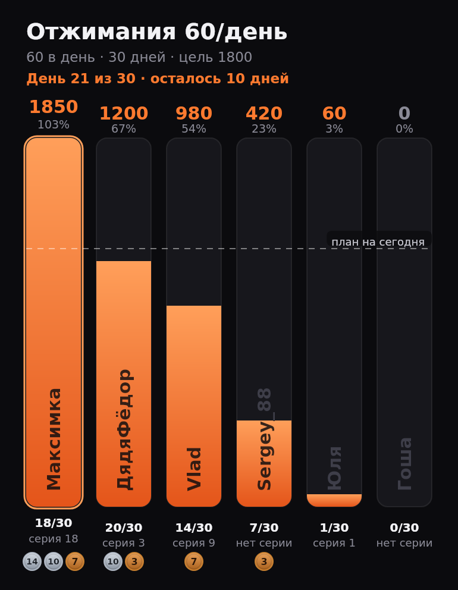

# Бот-лидерборд челленджа по отжиманиям

Телеграм-бот, который ведёт лидер-борды челленджей по отжиманиям: инициатор бросает
вызов, участники каждый день присылают скриншот из приложения с числом отжиманий,
бот рисует столбчатый график и раздаёт бейджи.



## Что умеет

* **Вызов на ограниченный круг** — максимум **6 участников** в челлендже, включая инициатора.
* **До 3 лидер-бордов одновременно** у одного человека: первый борд оранжевый,
  второй зелёный, третий голубой. Освободившийся цвет переиспользуется.
* **Срок и норма задаются вручную**: N отжиманий в день × D дней = цель челленджа.
* **Отчёт — скриншот, число бот читает сам.** Участник присылает скриншот вкладки
  **Week** из приложения, бот распознаёт подпись над сегодняшним столбиком через OCR.
  Ручного ввода количества нет. Считывается ровно один скриншот в день: первый
  присланный и есть отчёт, дополнить или переснять его нельзя.
* **Готовый текст вызова.** Сразу после создания бот отдельным сообщением присылает
  приглашение с условиями и ссылкой `t.me/бот?start=join_КОД` — его пересылают друзьям,
  переход по ссылке сразу открывает вход в челлендж.
* **Не больше одного отчёта в день.** Второй отчёт за тот же день бот не принимает —
  так не получается «догнать» пропуски задним числом.
* **Столбик = 100% цели.** Высота дорожки — вся цель челленджа, заливка растёт по мере
  отчётов, ник стоит внутри столбика неподвижно и не уезжает вместе с заливкой.
  Пунктир «план на сегодня» показывает, кто отстаёт от графика.
* **Итоги челленджа**: кто выполнил план, кому сколько отжиманий не хватило.
  Перевыполнившие борются за звание чемпиона — побеждает наибольшая сумма
  (при равенстве чемпионов несколько).
* **Бейджи**: серии 3, 7, 10, 14, 21, 30, 60, 100, 150, 200 и 365 дней подряд,
  а также «Чемпион», «Финишер» и «Лузер». Рисуются медалями: по команде `/badges`
  приходит витрина коллекции (полученные — яркие, остальные тусклые, с подписью,
  сколько дней осталось), а под каждым столбиком на борде видны три самых ценных
  бейджа его владельца.

## Быстрый старт

```bash
git clone https://github.com/vlad1q88-dotcom/challenge-bots.git
cd challenge-bots/pushup-bot
npm ci
cp .env.example .env      # вставь токен от @BotFather в BOT_TOKEN
npm start
```

Требуется Node.js 22.18+ (бот запускается прямо из TypeScript, без сборки).
Подробная пошаговая инструкция — от токена у @BotFather до автозапуска через systemd —
в [docs/deploy.md](docs/deploy.md).

Переменные окружения (`.env`):

| Переменная | По умолчанию | Зачем |
| --- | --- | --- |
| `BOT_TOKEN` | — | токен от [@BotFather](https://t.me/BotFather) |
| `CHALLENGE_TIMEZONE` | `Asia/Almaty` | по какому поясу считается «день» челленджа |
| `DATA_FILE` | `pushup-bot/data/db.json` | файл с данными |

## Команды

| Команда | Что делает |
| --- | --- |
| `/new` | бросить вызов: название → срок → норма в день → ник |
| `/join КОД` | принять вызов и выбрать ник |
| `/invite [КОД]` | прислать готовый текст вызова для друзей |
| `/begin КОД` | запустить челлендж (только инициатор, нужен хотя бы один соперник) |
| `/board [КОД]` | прислать картинку лидер-борда |
| `/boards` | список моих челленджей и занятых слотов |
| `/nick КОД НИК` | сменить ник (3–12 символов, уникальный внутри челленджа) |
| `/tz КОД ПОЯС` | часовой пояс челленджа до старта, например `Asia/Almaty` |
| `/leave КОД` | выйти до старта |
| `/delete КОД` | отменить челлендж до старта (только инициатор) |
| `/badges` | мои бейджи |
| `/rules` | правила и полный список бейджей |
| `/cancel` | прервать текущий диалог |

Отчёт: прислать боту скриншот недельного графика — больше ничего вводить не нужно.
Если активных челленджей несколько, бот предложит кнопки «во все» или конкретный борд
(в каждый челлендж можно отчитаться один раз в день).

## Как устроено

```
pushup-bot/src
├─ index.ts              запуск: конфиг → хранилище → бот
├─ config.ts             переменные окружения
├─ constants.ts          лимиты (6 участников, 3 борда, 3–12 символов ника) и цвета
├─ service.ts            сценарии: создать, принять, запустить, отчитаться, завершить
├─ domain/               чистая логика без Телеграма
│  ├─ challenge.ts       правила челленджа, прогресс, подсчёт итогов
│  ├─ badges.ts          бейджи и условия выдачи
│  ├─ streaks.ts         серии дней подряд
│  ├─ dates.ts           «день челленджа» в часовом поясе, арифметика по дням
│  ├─ nickname.ts        валидация ников
│  └─ plural.ts          склонение по числу
├─ ocr/                  распознавание скриншота
│  ├─ engine.ts          воркер tesseract.js (один на процесс, задания по очереди)
│  └─ screenshot.ts      поиск столбика за сегодня на недельном графике
├─ render/               картинка лидер-борда
│  ├─ fonts.ts           шрифт из assets/fonts — свой, а не системный
│  ├─ leaderboard.ts     столбчатый график на canvas
│  ├─ badges.ts          медали: витрина коллекции и значки под столбиками
│  └─ view.ts            состояние челленджа → данные для графика и подпись
├─ storage/store.ts      JSON-хранилище с атомарной записью
└─ telegram/             команды, диалоги, рассылка бордов
```

Данные лежат в одном JSON-файле (`DATA_FILE`), пишутся атомарно (временный файл + rename),
так что бэкап — это просто копия файла.

Раз в минуту бот проверяет челленджи, у которых закончился срок: подводит итоги,
раздаёт «Финишер» / «Чемпион» / «Лузер» и рассылает всем участникам финальный борд.

## Как бот читает скриншот

1. Скриншот скачивается из Телеграма и уходит в OCR (`tesseract.js`, английские
   языковые данные ставятся из npm-пакета `@tesseract.js-data/eng` — в рантайме
   сеть не нужна). Распознавание занимает около секунды.
2. В словах с координатами ищется ось дней недели (`Mon…Sun` или `Пн…Вс`).
3. Берётся колонка сегодняшнего дня, и над ней — ближайшая подпись столбика.
   Строки со словами (например `1 set · 5 reps total`) отбрасываются, поэтому
   сумма за неделю или счётчик из шапки профиля в отчёт не попадут.
4. Заголовок периода (`Aug 31 - Sep 6`) сверяется с сегодняшним днём: скриншот
   другой недели не принимается.

Бот отказывается принимать отчёт, если не нашёл недельный график, колонку за сегодня
или подпись над столбиком — и в ответе пишет, что именно прислать. Ещё две проверки:
один и тот же файл нельзя засчитать в челлендж дважды (сравнивается `file_unique_id`),
и второй отчёт за день не принимается.

Разбор скриншота (`src/ocr/screenshot.ts`) — чистая функция над словами с координатами,
поэтому он проверяется тестами на реальном выводе OCR (`tests/fixtures/week-screenshot.json`),
а `tests/ocr-engine.test.ts` прогоняет весь путь целиком на синтетическом скриншоте.

## Решения, которые стоит знать

* **Ручного ввода числа нет.** Если OCR не справился, бот объясняет, какой скриншот
  нужен, и ждёт новый — так число всегда берётся из приложения, а не из головы.
* **Серия считается внутри челленджа**: подряд идущие дни с отчётами в одном
  челлендже. Пропуск обнуляет её, новый челлендж начинает отсчёт заново, а отчёты
  в разные челленджи в разные дни в одну серию не складываются. Бейдж за серию
  выдаётся один раз навсегда, итоговые бейджи — за каждый челлендж.
* **День считается по `CHALLENGE_TIMEZONE`** (у каждого челленджа пояс сохраняется
  при создании), поэтому переход на летнее время не сдвигает границы дня.
* Челлендж стартует по команде инициатора, а не сразу после создания — чтобы все
  успели присоединиться и выбрать ники.

## Шрифт

Картинки рисуются шрифтом DejaVu Sans, который лежит в `assets/fonts/`
и регистрируется в canvas явно (`src/render/fonts.ts`). Полагаться на системный
`sans-serif` нельзя: на Windows он может оказаться без кириллицы, и подписи
превращаются в квадраты. Если файл шрифта не найден, рендер откатывается на
системный и пишет предупреждение в лог.

## Тесты

```bash
npm test        # node --test: домен, сервис, рендер
npm run typecheck
```
